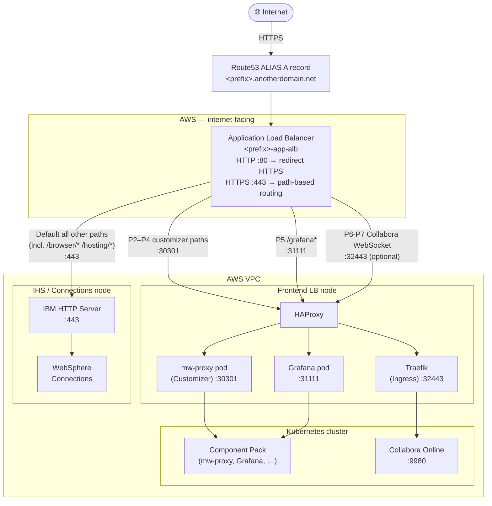
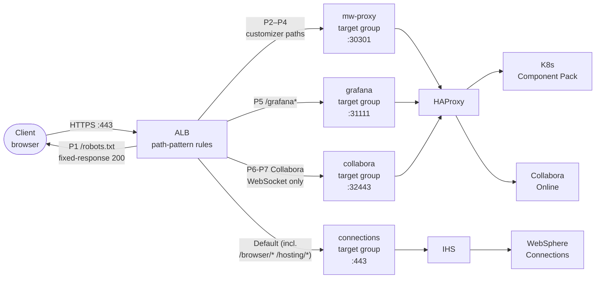

# Setting up an AWS Application Load Balancer for HCL Connections

> **Note:** This guide uses `anotherdomain.net` as an example ALB domain. You do not need to use a different domain—use your actual domain as appropriate. The example is for illustration only.

This guide explains how to provision and configure an AWS Application Load Balancer (ALB) in front of an existing HCL Connections deployment using the provided Ansible automation.

> **Note:** For general setup, prerequisites, and Ansible usage, see the [README](https://github.com/HCL-TECH-SOFTWARE/connections-automation/blob/main/README.md) and [VARIABLES reference](https://github.com/HCL-TECH-SOFTWARE/connections-automation/blob/main/documentation/VARIABLES.md#alb-variables).

---

## Architecture

### Component Overview

The ALB sits at the internet edge and routes HTTPS traffic to backend servers in your VPC based on URL path patterns.



### Request Flow



---

## Prerequisites

- **AWS CLI** installed and configured on the Ansible control node (`aws configure`)
- **IAM permissions**: EC2 (security groups, instance describe), ELB (create/modify ALB, listeners, target groups), Route53 (create records), ACM (describe/list certificates)
- **Ansible collections** installed:
  ```sh
  ansible-galaxy collection install amazon.aws community.aws
  ```
- A **Route53 public hosted zone** (e.g. `cnx-example.net`) already exists in your AWS account
- An **ACM certificate** covering your external Connections hostname (e.g. `*.cnx-example.net`) already exists and is in `ISSUED` state in the same region
- Backend EC2 instances (**HAProxy** and **IHS**) are running and reachable within the VPC
- **Security group IDs** for both backend instances are known (see `sg_frontend_lb` and `sg_ihs_server`)

---

## 1. Configure Inventory

The playbook uses two inventory groups to look up the EC2 instance IDs of the backend nodes. Update `environments/ALB/inventory.ini` (or your own inventory file) to point to the correct hostnames:

```ini
# Frontend LB node — HAProxy running mw-proxy and Grafana NodePorts
[frontend_lb]
web1.internal.example.com

# IHS / WebSphere Connections node
[was_servers:children]
cnx_was_servers

[cnx_was_servers]
connections1.internal.example.com
```

> The `frontend_lb` group feeds the first play (registers the HAProxy instance ID).
> The `was_servers` group feeds the second play (registers the IHS instance ID).
> The third play runs on `localhost` and makes all AWS API calls.

---

## 2. Configure group_vars

Add the following ALB block to your `group_vars/all.yml`. All values are required unless a default is shown.

```yaml
# --- AWS ALB Configuration ---
# VPC and networking
vpcid:           "vpc-xxxxxxxxxxxxxxxxx"
subnetid:
  - "subnet-xxxxxxxxxxxxxxxxx"   # AZ-a
  - "subnet-xxxxxxxxxxxxxxxxx"   # AZ-b
region:          "<region>"
hostedzone:      "cnx-example.net"

# ACM certificate ARN (must cover *.cnx-example.net)
certificatearn:  "arn:aws:acm:<region>:<account-id>:certificate/<certificate-id>"

# ALB name prefix (optional)
# When set, the ALB and all associated resources use this as the name prefix.
# When omitted, the prefix is auto-derived from the first 6 characters of the
# CNX server's AWS Name tag (e.g. 'connec' from 'connections1').
# alb_name: "myenv"

# ALB settings
idle_timeout:    300
ssl_policy:      "ELBSecurityPolicy-TLS13-1-2-2021-06"

# Security group IDs of backend instances
# The playbook adds inbound rules from the ALB security group into these
sg_frontend_lb:  "sg-xxxxxxxxxxxxxxxxx"   # HAProxy
sg_ihs_server:   "sg-xxxxxxxxxxxxxxxxx"   # IHS
```

Full variable reference:

| Variable | Default | Description |
|----------|---------|-------------|
| `alb_name` | *(auto-derived)* | Name prefix for the ALB and all associated resources. When omitted, the first 6 characters of the CNX server's AWS `Name` tag are used (e.g. `connec` from `connections1`) |
| `vpcid` | *required* | VPC ID containing the ALB and backend instances |
| `subnetid` | *required* | List of subnet IDs for the ALB (≥ 2 subnets, different AZs) |
| `region` | `us-east-2` | AWS region |
| `hostedzone` | `cnx-example.net` | Route53 hosted zone for the DNS alias record |
| `certificatearn` | *required* | ACM certificate ARN for the HTTPS listener |
| `idle_timeout` | `300` | ALB idle connection timeout in seconds |
| `ssl_policy` | `ELBSecurityPolicy-TLS13-1-2-2021-06` | TLS policy for the HTTPS listener |
| `cp_tls_enable` | `false` | When `true`, mw-proxy target group switches to HTTPS |
| `mw_proxy_port` | `30301` | mw-proxy HTTP port |
| `mw_proxy_port_https` | `30443` | mw-proxy HTTPS port |
| `sg_frontend_lb` | *required* | Security group ID of the HAProxy node |
| `sg_ihs_server` | *required* | Security group ID of the IHS node |
| `controller_https_node_port` | `32443` | Traefik HTTPS NodePort for Collabora (used when `cp_tls_enable` is true) |
| `controller_http_node_port` | `32080` | Traefik HTTP NodePort for Collabora (used when `cp_tls_enable` is false) |

---

## 3. Target Groups

The playbook creates four target groups. The name prefix defaults to the first 6 characters of the CNX server's AWS `Name` tag (e.g. `connec` from `connections1`). Set `alb_name` in `group_vars/all.yml` to use a custom prefix instead.

| Target Group | Protocol | Port | Backend Node | Health Check Path | Healthy Codes |
|---|---|---|---|---|---|
| `<prefix>-mw-proxy` | HTTP or HTTPS | 30301 or 30443 | HAProxy | `/` | 200, 301 |
| `<prefix>-grafana` | HTTP | 31111 | HAProxy | `/grafana/` | 200, 302 |
| `<prefix>-connections` | HTTPS | 443 | IHS | `/` | 200, 301, 302 |
| `<prefix>-collabora` | HTTP or HTTPS | 32080 or 32443 | HAProxy | `/cool/hosting/discovery` | 200, 301, 302, 404 |

Health check settings for all groups: interval 15 s, timeout 3 s, healthy threshold 3, unhealthy threshold 2.

> The Collabora target group routes to HAProxy, which forwards to the Traefik ingress controller NodePort on the K8s node. Traefik then forwards to the `collabora-online` K8s service on port 9980. The protocol and port are determined by `cp_tls_enable` (HTTPS/32443 when true, HTTP/32080 when false).

---

## 4. ALB Listener Rules

### HTTP :80 Listener

All HTTP traffic is redirected to HTTPS with a `301` redirect. No further rules apply.

### HTTPS :443 Listener

Rules are evaluated in priority order. The first match wins.

| Priority | Path Pattern(s) | Action | Destination |
|---|---|---|---|
| 1 | `/robots.txt` | Fixed response `200 text/plain` | `User-agent: *\nDisallow: /\n` |
| 2 | `/files/customizer*` `/files/app*` `/communities/service/html*` `/forums/html*` `/search/web*` | Forward | `<prefix>-mw-proxy` TG |
| 3 | `/homepage/web*` `/social/home*` `/mycontacts*` `/wikis/home*` `/blogs*` | Forward | `<prefix>-mw-proxy` TG |
| 4 | `/news*` `/activities/service/html*` `/profiles/html*` `/viewer*` | Forward | `<prefix>-mw-proxy` TG |
| 5 | `/grafana*` | Forward | `<prefix>-grafana` TG |
| 6 | `/cool/adminws` `/cool/ws` `/cool/*/ws` `/controller/adminws` `/controller/ws` | Forward | `<prefix>-collabora` TG |
| 7 | `/controller/*/ws` | Forward | `<prefix>-collabora` TG |
| Default | *(all other paths, incl. `/browser/*` `/hosting/*` non-WS `/cool/*`)* | Forward | `<prefix>-connections` TG (IHS) |

> Priorities 2–4 all forward to the **mw-proxy** target group (Customizer). They are split across three rules because ALB limits the number of path patterns per rule.
>
> Priorities 6–7 route **only Collabora WebSocket upgrade paths** to the Traefik ingress controller. These patterns match the nginx rule `^/(cool|controller)/(adminws|ws|.+/ws)$`. All other Collabora HTTP paths (`/browser/*`, `/hosting/*`, `/cool/hosting/discovery`) fall through to IHS (default rule) and are proxied via IHS → HAProxy → Traefik. The ALB natively handles WebSocket upgrade — no separate configuration is needed. If Collabora is not deployed, these paths return 502 but do not affect any other Connections functionality.

---

## 5. Security Groups

The playbook manages security group rules automatically

**ALB security group** (`<prefix>-app-alb-sg`) — created by the playbook:
- Inbound TCP 80 from `0.0.0.0/0` (HTTP, redirected to HTTPS)
- Inbound TCP 443 from `0.0.0.0/0` (HTTPS)

**Frontend LB security group** (`sg_frontend_lb`) — modified by the playbook:
- Inbound TCP 30301 or 30443 from ALB SG (mw-proxy / Customizer, based on `cp_tls_enable`)
- Inbound TCP 31111 from ALB SG (Grafana)
- Inbound TCP 32443 or 32080 from ALB SG (Traefik for Collabora)

**IHS security group** (`sg_ihs_server`) — modified by the playbook:
- Inbound TCP 443 from ALB SG (HTTPS to IHS)

> You must set `sg_frontend_lb` and `sg_ihs_server` in `group_vars/all.yml` before running the playbook. The playbook will fail with a clear validation error if they are missing.

---

## 6. DNS

After the ALB is created, the playbook automatically creates a **Route53 ALIAS A record**:

```
<prefix>.<hostedzone>  →  ALIAS  →  <alb-dns-name>.elb.amazonaws.com
```

For example, with `hostedzone: cnx-example.net` and a CNX server named `connections1`, the record becomes:

```
connec.cnx-example.net  →  ALIAS  →  connec-app-alb-<id>.<aws-region>.elb.amazonaws.com
```

An ALIAS record is used (not a CNAME) because it resolves within AWS without an extra DNS query and incurs no Route53 query charges.

---

## 7. Run the Playbook

```sh
ansible-playbook -i environments/ALB/inventory.ini \
  playbooks/third_party/aws-alb/setup-app-load-balancer.yml
```

Override individual variables at runtime using `-e`:

```sh
ansible-playbook -i environments/ALB/inventory.ini \
  playbooks/third_party/aws-alb/setup-app-load-balancer.yml \
  -e "idle_timeout=600 ssl_policy=ELBSecurityPolicy-TLS13-1-2-2021-06"
```

### What the playbook does

The playbook runs three sequential plays:

1. **`frontend_lb` hosts** — reads the EC2 instance ID of the HAProxy node and writes it to `~/id_file_cp` on the control node
2. **`was_servers` hosts** — reads the EC2 instance ID of the IHS/Connections node and writes it to `~/id_file_cnx` on the control node
3. **`localhost`** — uses the collected instance IDs to:
   - Validate `sg_frontend_lb` and `sg_ihs_server` are set
   - Create the ALB security group
   - Create four target groups (mw-proxy, grafana, connections, collabora) and register instances
   - Create the ALB with HTTP redirect and HTTPS listener rules (P1–P7)
   - Create the Route53 ALIAS record
   - Add inbound rules to the backend security groups
   - Print the ALB URL

---

## 8. Post-Deployment Verification

After the playbook completes, the final debug task will print the ALB URL:

```
TASK [Display URL to access ALB]
ok: [localhost] => {
    "msg": "ALB is accessible at https://connec.cnx-example.net"
}
```

Run the following checks to verify the deployment:

**Check the Route53 record:**
```sh
dig +short connec.cnx-example.net
```

**Test default routing (IHS / Connections):**
```sh
curl -I https://connec.cnx-example.net/
# Expected: HTTP 200, 301, or 302 from IHS
```

**Verify target group health in AWS console or CLI:**
```sh
aws elbv2 describe-target-health \
  --target-group-arn <arn> \
  --region <aws-region>
# All targets should show "healthy"
```

---

## 9. Collabora Online Support

The ALB includes routing for **Collabora WebSocket upgrade paths only** to the Traefik ingress controller running on the HAProxy/frontend LB node. All other Collabora HTTP paths are routed via IHS (default rule), matching the nginx configuration pattern.

### How It Works

The ALB role always creates:
1. A fourth target group (`<prefix>-collabora`) pointing to HAProxy on the Traefik NodePort
2. **P6 and P7 listener rules** forwarding WebSocket paths to the Collabora target group:
   - P6: `/cool/adminws`, `/cool/ws`, `/cool/*/ws`, `/controller/adminws`, `/controller/ws`
   - P7: `/controller/*/ws`
3. A security group rule allowing ALB → HAProxy on the Traefik port
4. All other Collabora paths (`/browser/*`, `/hosting/*`, non-WS `/cool/*`) fall through to the **default rule** → IHS → HAProxy → Traefik → Collabora pods

This matches the nginx rule `location ~ ^/(cool|controller)/(adminws|ws|.+/ws)$` from `roles/hcl/collabora/configure-nginx`.

No additional variables are required — the Traefik ports default to `32443` (HTTPS) / `32080` (HTTP) based on `cp_tls_enable`.

### Prerequisites for Collabora to Function

- Collabora Online deployed in Kubernetes (via `playbooks/hcl/harbor/setup-collabora.yml`)
- A K8s Ingress resource for Collabora exists (paths: `/cool/`, `/browser/`, `/hosting/`) with `ingressClassName: cnx-ingress-traefik`
- Traefik ingress controller running with its NodePort exposed through HAProxy
- IHS configured with `ProxyPass` rules for Collabora HTTP paths (handled by `roles/hcl/collabora/configure-ihs`)

### Without Collabora Installed

If the ALB is created before Collabora is deployed:
- The Collabora target group will be created but health checks will report unhealthy targets
- The P6-P7 rules will return HTTP `502` for WebSocket upgrade requests
- HTTP paths like `/browser/*` and `/hosting/*` will route through IHS and also return `502` (no backend)
- **All other Connections functionality is unaffected** — P1–P5 and the default rule work normally
- Once Collabora is deployed later, the routing starts working automatically without re-running the ALB playbook

### Verification

```sh
# WOPI discovery endpoint (routes via IHS, should return XML)
curl -s https://<alb-hostname>/hosting/discovery | head -5

# Collabora admin console (routes via IHS)
curl -I https://<alb-hostname>/browser/dist/admin/admin.html
# Expected: 200 (or 401 if auth configured)

# WebSocket upgrade test (routes via ALB P6 rule directly to Traefik)
curl -I -H "Upgrade: websocket" -H "Connection: Upgrade" \
  https://<alb-hostname>/cool/adminws
# Expected: 101 Switching Protocols

# Verify non-WS /cool/* routes through IHS (check X-Forwarded-* headers)
curl -I https://<alb-hostname>/cool/hosting/discovery
# Should show IHS in the path (via default rule → IHS → HAProxy → Traefik)
```

---

## 10. Hostname Migration After Switching to ALB (existing deployment)

After the ALB is created, you need to migrate the Connections application from the old hostname to the new ALB hostname. This is handled by a dedicated migration playbook.

### Prerequisites

Update `group_vars/all.yml` **before** running the migration playbook:

```yaml
# Old values
cnx_application_ingress: "web1.example.com"
nginx_custom_cert_sans:  "*.internal.example.com,*.example.com"

# New values (after ALB)
cnx_application_ingress: "connections.anotherdomain.net"
nginx_custom_cert_sans:  "*.internal.example.com,*.example.com,*.anotherdomain.net"
```

### Running the Migration

```bash
ansible-playbook -i environments/<env>/inventory.ini \
  playbooks/third_party/aws-alb/migrate-nginx-to-alb.yml
```

### What the Playbook Does

1. **Regenerate HAProxy cert** — includes `*.anotherdomain.net` in SANs for ALB → HAProxy HTTPS
2. **Update WAS `dynamicHosts`** — sets `href`/`ssl_href` in `LotusConnections-config.xml` to the new hostname
3. **Update WAS SSO domains** — adds `.anotherdomain.net` to SSO cookie domains
4. **Add ALB cert to WAS trust store** — WAS must trust the new hostname's TLS certificate
5. **Re-deploy Component Pack** — updates `connections-env` configmap (`ic.host`) and all K8s Ingress `host:` rules
6. **Sync & restart WAS** — pushes config to nodes, restarts DMGR, node agents, and CNX clusters

> **Note:** The playbook reuses existing roles (`was-dmgr-config-sso-update`, `was-dmgr-config-add-cert-truststore`, `haproxy-install`, `component-pack-harbor`) and does not duplicate logic.

### Verification

```bash
# WAS dynamicHosts
grep -A2 'dynamicHosts' /opt/IBM/WebSphere/AppServer/profiles/Dmgr01/config/cells/*/LotusConnections-config/LotusConnections-config.xml

# K8s configmap
kubectl get configmap connections-env -n connections -o yaml | grep ic-host

# K8s ingress host rules
kubectl get ingress -n connections -o wide

# End-to-end test
curl -kI https://<alb-hostname>/homepage
```

---
